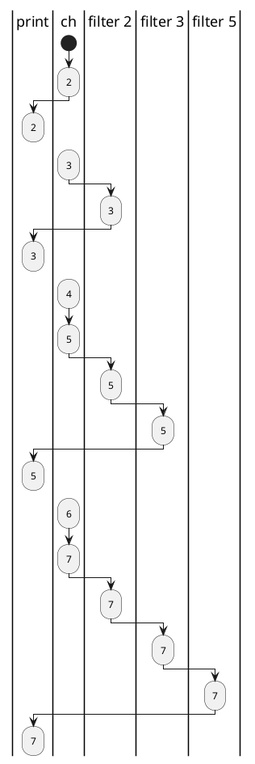

# pipe and filter pattern
The Way To GO 一书关于管道过滤模式写过这样的一个例子：
片段1：
````go
func main() {
    ch := make(chan int) // Create a new channel.
    go generate(ch) // Start generate() as a goroutine.
    for {
        prime := <-ch
        fmt.Print(prime," ")
        ch1 := make(chan int)
        go filter(ch, ch1, prime)
        ch = ch1
    }
}
````
片段2：
````go
// Send the sequence 2, 3, 4, ... to channel ch.
func generate(ch chan int) {
    for i := 2; ; i++ {
    ch <- i // Send i to channel ch.
    }   
}
````
片段3：
````go
// Copy the values from channel in to channel out,
// removing those divisible by prime.
func filter(in, out chan int, prime int) {
    for {
    i := <-in // Receive value of new variable i from in.
    if i%prime != 0 {
        out <- i // Send i to channel out.
        }
    }
}
````

执行这段代码会不停地打印出大于等2的质数： 2 3 5 7 11 13 17 19 23 29 31 37 41 43 47......
在片段1中`go generate(ch)`创建了一个goroutine，它不断向`ch`中写入间隔为1的递增序列: 2 3 4 5 6 7 8 9 10 11.....
语句`prime := <-ch`将`ch`首次放入的数据取出，该数必为质数。通过执行`go filter(ch,ch1,prime)`将`ch`中不被prime整除的数放入`ch1`中。片段1的数据流动过程可以表示如下：

`print`表示打印的数据通道，`ch`为原始产生递增序列的通道，`filter 2`为根据`ch`产生的不被2整出的数据通道，`filter 3`为根据`filter 2`产生的不被3整除的数据通道。